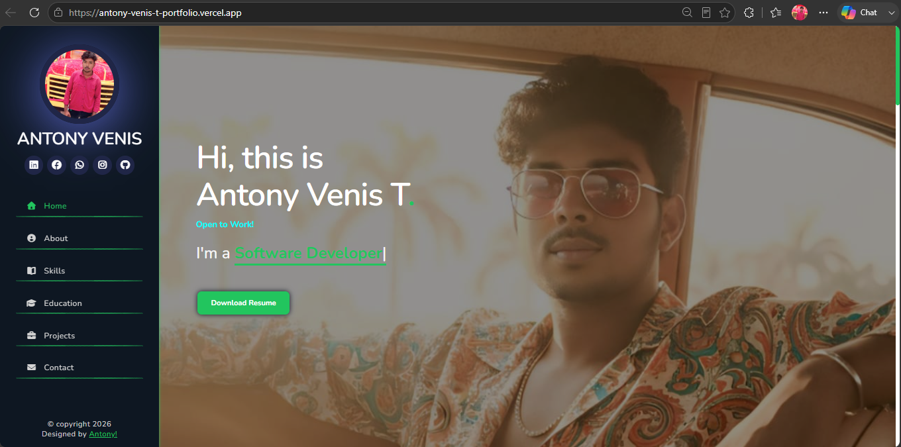

<!-- <div align="center">

# 👑 Antony Venis Portfolio

</div>
<div align="center">

# ⚡ Antony Venis T ⚡

### Python Full Stack Developer | React & Django Developer | SoftWare & Web Developer

🚀 Passionate about building modern, responsive and scalable web applications.

🌐 **Live Portfolio:** https://antony-venis-t-portfolio.vercel.app/

</div>

---

## 📌 About Me

Hi, I'm **Antony Venis**, a passionate Python Full Stack Developer from Chennai, India.

I completed my **B.Sc Mathematics (2025)** and successfully completed a **Python Full Stack Development Program**.

I enjoy creating responsive web applications, solving real-world problems, and continuously learning modern technologies.

---

## 🚀 Skills

### Frontend

* HTML5
* CSS3
* JavaScript
* React JS
* Bootstrap

### Backend

* Python
* Django

### Database

* SQLite
* MySQL

### Tools

* Git
* GitHub
* VS Code
* Vercel

---

## ✨ Portfolio Features

✅ Fully Responsive Design

✅ Mobile Friendly Navigation

✅ Smooth Scrolling Sections

✅ Skills Progress Animation

✅ Download Resume Feature

✅ Contact Section

✅ Professional UI Design

✅ Fast Loading Performance

---

## 📂 Sections Included

* 🏠 Home
* 👨‍💻 About Me
* 🛠 Skills
* 🎓 Education
* 💼 Projects
* 📞 Contact

---

## 💼 Projects

### 🛒 E-Commerce Website

Modern online shopping platform built using React & Django.

### 👨‍💻 Portfolio Website

Personal portfolio showcasing skills, projects, and experience.

### 📚 Student Management System

CRUD application built with Django and Database integration.

---

## 🛠 Tech Stack

| Technology   | Usage                |
| ------------ | -------------------- |
| HTML         | Structure            |
| CSS          | Styling              |
| JavaScript   | Functionality        |
| React JS     | Frontend Development |
| Python       | Backend Logic        |
| Django       | Web Framework        |
| Git & GitHub | Version Control      |

---

## 📸 Portfolio Preview

Add your screenshot here:

```md

```

---

## 📄 Resume

Download my latest resume directly from the portfolio.

---

## 📬 Contact Me

📧 Email: [antonyvenis1212@gmail.com](mailto:antonyvenis1212@gmail.com)

📱 Phone: +91 9751729345

💼 LinkedIn:
https://www.linkedin.com/in/antony-venis-t-30353529a

🐙 GitHub:
https://github.com/antonyvenis

🌐 Portfolio:
https://antony-venis-t-portfolio.vercel.app/

---

<div align="center">

### ⭐ If you like this project, don't forget to give it a Star ⭐

Made with ❤️ by Antony Venis

</div> -->


<div align="center">

# 👑 Antony Venis Portfolio


# ⚡ Antony Venis T ⚡

### Python Full Stack Developer | React & Django Developer | Software & Web Developer

🚀 Passionate about building modern, responsive and scalable web applications.

🌐 **Live Portfolio:** https://antony-venis-t-portfolio.vercel.app/

</div>

---

## 📌 About Me

Hi, I'm **Antony Venis**, a passionate Python Full Stack Developer from Chennai, India.

I completed my **B.Sc Mathematics (2025)** and successfully completed a **Python Full Stack Development Program**.

I enjoy creating responsive web applications, solving real-world problems, and continuously learning modern technologies.

---

## 🌐 Live Demo

👉 **Portfolio Website:**
https://antony-venis-t-portfolio.vercel.app/

---

## 📸 Portfolio Preview

<p align="center">
  
</p>

---

## 🚀 Skills

### Frontend

* HTML5
* CSS3
* JavaScript
* React JS
* Bootstrap

### Backend

* Python
* Django

### Database

* SQLite
* MySQL

### Tools

* Git
* GitHub
* VS Code
* Vercel

---

## ✨ Portfolio Features

✅ Fully Responsive Design

✅ Mobile Friendly Navigation

✅ Smooth Scrolling Sections

✅ Skills Progress Animation

✅ Download Resume Feature

✅ Contact Section

✅ Professional UI Design

✅ Fast Loading Performance

---

## 📂 Sections Included

* 🏠 Home
* 👨‍💻 About Me
* 🛠 Skills
* 🎓 Education
* 💼 Projects
* 📞 Contact

---

## 💼 Featured Projects

### 🛒 E-Commerce Website

Modern online shopping platform built using React & Django.

### 👨‍💻 Portfolio Website

Personal portfolio showcasing skills, projects, and experience.

### 🎓 Student Management System

CRUD application built using Django Class-Based Views with SQLite database integration.

---

## 🛠 Tech Stack

| Technology   | Usage                |
| ------------ | -------------------- |
| HTML         | Structure            |
| CSS          | Styling              |
| JavaScript   | Functionality        |
| React JS     | Frontend Development |
| Python       | Backend Logic        |
| Django       | Web Framework        |
| Git & GitHub | Version Control      |

---

## 📄 Resume

Download my latest resume directly from the portfolio website.

---

## 📬 Contact Me

📧 Email: [antonyvenis1212@gmail.com](mailto:antonyvenis1212@gmail.com)

📱 Phone: +91 9751729345

💼 LinkedIn:
https://www.linkedin.com/in/antony-venis-t-30353529a

🐙 GitHub:
https://github.com/antonyvenis

🌐 Portfolio:
https://antony-venis-t-portfolio.vercel.app/

---

## ⭐ Support

If you like this project, don't forget to give it a ⭐ Star on GitHub.

---

<div align="center">

### Made with ❤️ by Antony Venis

</div>
